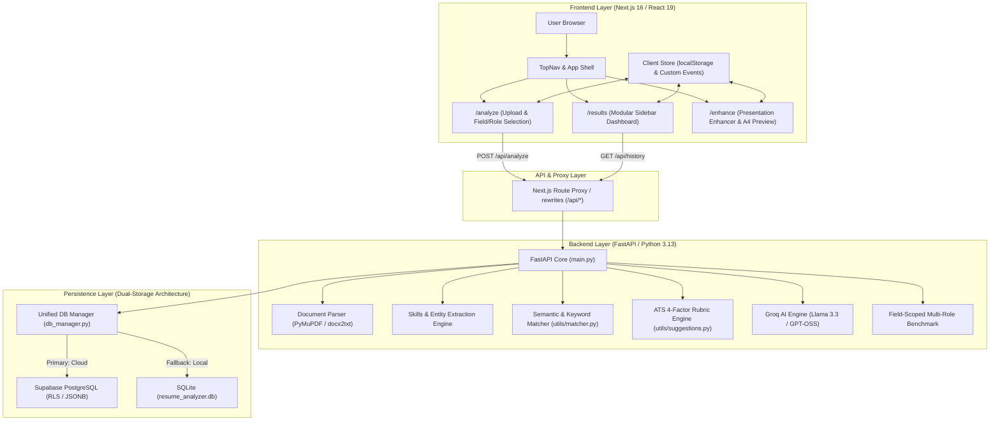

# AI Resume Analyzer — Comprehensive Technical Architecture Report

**Version:** 2.0.0 (Branch: `final`)  
**Document Type:** Technical System Architecture & Implementation Report  
**Scope:** Backend (FastAPI / Groq AI), Frontend (Next.js 16 / React 19 / Tailwind), and Database (Supabase PostgreSQL & SQLite)

---

## 1. Executive Summary & System Topology

The **AI Resume Analyzer (Resumind)** is an enterprise-grade web application designed to evaluate, benchmark, and enhance professional resumes against industry standards and custom job descriptions. It leverages a hybrid intelligence approach combining deterministic rule-based algorithms with Large Language Models (Groq Cloud LLM / OpenAI API interface) and cloud/local database persistence.

### High-Level System Architecture



---

## 2. Backend Architecture Deep Dive

The backend is built with **FastAPI** (`backend/main.py`), utilizing asynchronous I/O, Pydantic type validation, and Python 3.13.

### 2.1 File Ingestion & Parsing Pipeline (`backend/utils/parser.py`)

- **Multi-Format Ingestion:** Supports `.pdf` (via `pymupdf`/`fitz`) and `.docx` (via `docx2txt`), capped at 5 MB per file.
- **Candidate Entity Extraction:**
  - **Candidate Name:** Employs header-level heuristic analysis, looking at the first 3 lines of the document while filtering out emails, phone numbers, URLs, and section titles like "Resume", "Curriculum Vitae", or "Objective".
  - **Contact Information:** Regex pattern extractors for RFC 5322 email formats, international E.164 phone numbers, LinkedIn profile handles, and GitHub repository links.
  - **Education Extraction:** Pattern matching against recognized degrees (`BS`, `MS`, `B.Tech`, `M.Tech`, `Bachelor`, `Master`, `PhD`, `Diploma`), university names, and graduation date ranges.
  - **Work Experience Extraction:** Chronological segmentation capturing job titles, company names, employment durations (month/year ranges), and bullet items.

### 2.2 Skill Extraction & Taxonomy Engine (`backend/utils/skills_db.py`)

- Over **500+ curated technical and domain skills** across 10 major industry domains.
- Normalized multi-word matching with token boundary recognition to avoid false positives (e.g., distinguishing "C" language from single letters, "Go" from common English verbs).
- **Categorization:** Skills are grouped into Technical Skills, Soft Skills, Tools & Frameworks, Cloud & Infrastructure, and Domain Concepts.

### 2.3 Job Catalog & Field-Scoped Benchmarking (`backend/data/jobs.json` & `backend/utils/matcher.py`)

- **104 Predefined Roles** categorized across **10 distinct industry fields**:
  1. *Software Engineering* (16 roles: Frontend, Backend, Fullstack, Systems, DevOps, etc.)
  2. *Data & Artificial Intelligence* (15 roles: AI/ML, NLP, Computer Vision, MLOps, Data Scientist, Quant)
  3. *Cloud & DevOps Infrastructure* (12 roles: Cloud Architect, SRE, Platform Engineer, Kubernetes Specialist)
  4. *Cybersecurity & Infosec* (10 roles: Pen Tester, SOC Analyst, Security Architect, Incident Responder)
  5. *Product & Project Management* (10 roles: Technical PM, Scrum Master, Agile Coach, Product Owner)
  6. *Sales, HR & Operations* (9 roles: Tech Recruiter, Sales Engineer, HR Operations, Customer Success)
  7. *Quality Assurance & SDET* (8 roles: Automation Engineer, QA Lead, Performance Test Engineer)
  8. *Finance & Accounting* (8 roles: Financial Analyst, Risk Analyst, Auditor, Corporate Controller)
  9. *Marketing & Growth* (8 roles: Growth Hacker, SEO Specialist, Performance Marketer, Content Strategist)
  10. *UI/UX & Product Design* (8 roles: Product Designer, UX Researcher, Interaction Designer)

- **Field-Scoped Benchmarking Algorithm:**
  Instead of comparing a software engineer against 100 unrelated roles (e.g. accounting, civil), the engine queries the selected role's `field` (or extracts domain keywords for custom JDs) and benchmarks the resume against all peer roles in that specific field.
  - Generates a **ranked leaderboard** showing `matchScore`, `semanticScore`, `matchedSkillsCount`, and missing skills.
  - Identifies the candidate's **Best Fit Role** and **Relative Percentile**.

### 2.4 Matching Engine & ATS Scoring (`backend/utils/scorer.py` & `backend/utils/suggestions.py`)

The overall score is calculated using a hybrid deterministic and semantic model:

$$\text{Final Match Score} = (0.75 \times \text{Keyword Match}) + (0.25 \times \text{Semantic Cosine Similarity})$$

Where:
- **Keyword Match** weights required skills at 70% and preferred skills at 30%.
- **Semantic Cosine Similarity** calculates the cosine similarity between TF-IDF vector embeddings of the resume text and the target job description.

#### Comprehensive 4-Factor ATS Rubric (/100)

| Rubric Component | Max Weight | Evaluation Criteria |
| :--- | :--- | :--- |
| **Keyword Match** | 35 pts | Exact & fuzzy matching of mandatory role skills |
| **Impact Quantification** | 25 pts | Frequency of quantifiable metrics (%, \$, numbers, multipliers `2x`, `10k`) |
| **Action Verb Quality** | 20 pts | Usage of strong past-tense impact verbs (*Spearheaded*, *Orchestrated*, *Engineered*, *Optimized*) |
| **Formatting & Readability** | 20 pts | Structural integrity, section headers, contact completeness, bullet syntax |

### 2.5 AI Enhancement with Groq LLM (`backend/utils/ai_engine.py`)

- **Model Hierarchy:** Dynamic model discovery with fallbacks:
  1. `openai/gpt-oss-120b`
  2. `llama-3.3-70b-versatile`
  3. `llama-3.1-8b-instant`
- **Output Strictness:** Configured with `temperature=0.2` and `response_format={"type": "json_object"}`.
- **STAR Rewrites:** Automatically identifies weak, unquantified bullets in the candidate's experience and rewrites them into high-impact **Situation-Task-Action-Result (STAR)** format.
- **Deterministic Fallback:** If `GROQ_API_KEY` is not provided or rate limits are reached, the system gracefully falls back to deterministic rule-based suggestions without breaking the API contract.

### 2.6 REST API Specification

| Method | Endpoint | Description | Request Payload | Response Model |
| :--- | :--- | :--- | :--- | :--- |
| `GET` | `/api/health` | Service health, DB backend, and AI status | None | `HealthResponse` |
| `GET` | `/api/jobs` | Complete list of 104 job roles across 10 fields | None | `List[JobRole]` |
| `POST` | `/api/analyze` | Full resume parsing, ATS scoring, and auto-save | `multipart/form-data`: `resume` (file), `jobRole` (str), `customJd` (str) | `AnalysisResult` |
| `POST` | `/api/compare-roles` | Multi-role benchmark leaderboard | `multipart/form-data`: `resume`, `roleIds`, `field` | `MultiRoleComparison` |
| `GET` | `/api/history` | Historical analysis list (paginated) | Query param: `limit` (int, default 20) | `HistoryResponse` |
| `GET` | `/api/history/{id}` | Detailed historical analysis result | Path param: `record_id` (UUID/str) | `AnalysisResult` |

---

## 3. Frontend Architecture Deep Dive

The frontend is built with **Next.js 16.3.8** (Turbopack engine), **React 19**, and **Tailwind CSS**.

### 3.1 Routing & Layout Architecture

```
frontend/ai-resume-analyzer/
├── app/
│   ├── layout.tsx         # Root layout with Inter font and global styling
│   ├── page.tsx           # Redirects to /analyze
│   ├── globals.css        # Design tokens, animations, and @media print A4 styles
│   ├── analyze/
│   │   └── page.tsx       # Entry point for AnalyzeRoute
│   ├── results/
│   │   └── page.tsx       # Entry point for ResultsRoute
│   └── enhance/
│       └── page.tsx       # Entry point for EnhanceRoute
```

### 3.2 Modular Dashboard Navigation System

To eliminate excessive vertical scrolling on desktop viewports, the `/results` page implements a **Hard White Sidebar** docked to the left screen edge (`w-64 xl:w-72 bg-white border-r border-slate-200 sticky top-16`):

1. **Overview & Scores:** Score gauge, ATS Rubric breakdown, matched & missing skill cards, and presentation polish banner.
2. **Multi-Role Benchmark:** Ranked leaderboard of all peer roles in the chosen field with fit scores and gap tags.
3. **AI Improvements:** Actionable suggestions and Groq STAR rewrites (before vs. after).
4. **Skill Gap Analysis:** Detailed skill alignment grid comparing candidate competencies with market expectations.
5. **Experience & Report:** Chronological work history, education credentials, and overall candidate assessment summary.
6. **Direct Sidebar Actions:** Live candidate match badge and one-click "Enhance Resume" action.

### 3.3 Zero-Emoji Design System

- All emojis have been purged from the codebase.
- Replaced with custom, accessible SVG icons in [`components/core/Icons.tsx`](file:///c:/Users/aayus/Downloads/ai%20resume%20analyzer/frontend/ai-resume-analyzer/components/core/Icons.tsx) (Lucide-inspired stroke geometry):
  - `BarChartIcon`, `TrophyIcon`, `SparkIcon`, `TargetIcon`, `BriefcaseIcon`, `ArrowRightIcon`, `CheckIcon`, `UploadIcon`, `SearchIcon`, `FileTextIcon`.

### 3.4 Searchable Field and Role Selectors

Implemented with debounced search input, keyboard navigation, and field grouping:
- [`SearchableFieldSelect.tsx`](file:///c:/Users/aayus/Downloads/ai%20resume%20analyzer/frontend/ai-resume-analyzer/components/analyze/SearchableFieldSelect.tsx): Categorizes the 104 roles into 10 clean fields.
- [`SearchableRoleSelect.tsx`](file:///c:/Users/aayus/Downloads/ai%20resume%20analyzer/frontend/ai-resume-analyzer/components/analyze/SearchableRoleSelect.tsx): Filters roles belonging strictly to the selected field, with instant search.
- **Custom JD Toggle:** Allows pasting raw text job descriptions, seamlessly switching the backend into custom matching mode.

### 3.5 Resume Presentation Enhancer (`/enhance`)

A complete client-side presentation analysis and previewing engine:
- **Presentation Analysis Engine (`enhanceData.ts`):** Deterministically analyzes formatting quality across 4 pillars:
  - *Typography:* Hierarchy, name emphasis, font sizing.
  - *Spacing:* Section padding, whitespace rhythm, breathing room.
  - *Structure:* Logical progression (Contact $\to$ Summary $\to$ Skills $\to$ Experience $\to$ Education).
  - *Consistency:* Date format uniformity (e.g. `2021 — 2023` vs `Jan 2021`), bullet punctuation.
- **3 Professional Style Presets:**
  - *Modern:* Clean sans-serif, subtle colored accent headers, compact pill badges.
  - *Classic:* Traditional serif typography, horizontal dividing rules, formal corporate layout.
  - *Compact:* High-density layout engineered for dense multi-year technical resumes to fit cleanly on 1 page.
- **Before & After Live Preview:** Side-by-side or tabbed view showing raw text vs. enhanced document.
- **Native A4 Print Stylesheet (`@media print`):** Formatted for exact A4 dimensions ($210\,\text{mm} \times 297\,\text{mm}$) with zero margin clipping, allowing direct high-resolution PDF export via browser print (`Ctrl+P`).

---

## 4. Database Architecture Deep Dive

The application implements a **Dual-Layer Persistence Pattern** managed by [`backend/database/db_manager.py`](file:///c:/Users/aayus/Downloads/ai%20resume%20analyzer/backend/database/db_manager.py). It seamlessly prioritizes Supabase Cloud PostgreSQL while guaranteeing 100% offline availability via SQLite fallback.

### 4.1 Supabase PostgreSQL Schema (Cloud Production)

```sql
-- 1. Resumes Master Table
CREATE TABLE IF NOT EXISTS public.resumes (
    id UUID PRIMARY KEY DEFAULT gen_random_uuid(),
    candidate_name TEXT,
    file_name TEXT NOT NULL,
    storage_path TEXT,
    raw_text TEXT,
    created_at TIMESTAMP WITH TIME ZONE DEFAULT timezone('utc'::text, now()) NOT NULL
);

-- 2. Resume Analyses Detail Table
CREATE TABLE IF NOT EXISTS public.resume_analyses (
    id UUID PRIMARY KEY DEFAULT gen_random_uuid(),
    resume_id UUID REFERENCES public.resumes(id) ON DELETE CASCADE,
    job_role_id TEXT NOT NULL,
    match_score INTEGER NOT NULL,
    matched_skills JSONB DEFAULT '[]'::jsonb,
    missing_skills JSONB DEFAULT '[]'::jsonb,
    extracted_skills JSONB DEFAULT '[]'::jsonb,
    education JSONB DEFAULT '[]'::jsonb,
    experience JSONB DEFAULT '[]'::jsonb,
    suggestions JSONB DEFAULT '[]'::jsonb,
    created_at TIMESTAMP WITH TIME ZONE DEFAULT timezone('utc'::text, now()) NOT NULL
);

-- 3. Row Level Security (RLS)
ALTER TABLE public.resumes ENABLE ROW LEVEL SECURITY;
ALTER TABLE public.resume_analyses ENABLE ROW LEVEL SECURITY;

CREATE POLICY "Allow public read on resumes" ON public.resumes FOR SELECT USING (true);
CREATE POLICY "Allow public insert on resumes" ON public.resumes FOR INSERT WITH CHECK (true);
CREATE POLICY "Allow public read on resume_analyses" ON public.resume_analyses FOR SELECT USING (true);
CREATE POLICY "Allow public insert on resume_analyses" ON public.resume_analyses FOR INSERT WITH CHECK (true);
```

### 4.2 SQLite Schema (Local Zero-Config Fallback)

Stored at `backend/database/resume_analyzer.db`:

```sql
CREATE TABLE IF NOT EXISTS resumes (
    id TEXT PRIMARY KEY,
    candidate_name TEXT,
    file_name TEXT,
    job_role_id TEXT,
    match_score INTEGER,
    matched_skills TEXT,
    missing_skills TEXT,
    analysis_data TEXT,
    created_at TEXT
);
```

### 4.3 Database Layer Comparison & Behavior

| Feature | Supabase PostgreSQL | Local SQLite Fallback |
| :--- | :--- | :--- |
| **Primary Key** | `UUID` (PostgreSQL `gen_random_uuid()`) | `TEXT` (Python `uuid.uuid4()`) |
| **Complex Objects** | Native `JSONB` with indexing capabilities | Serialized `TEXT` (JSON strings) |
| **Relational Integrity** | Foreign Key (`resume_id REFERENCES resumes(id)`) | Single denormalized record |
| **Security** | Row Level Security (RLS) policies | Local filesystem permission |
| **Automatic Failover** | If connection fails or credentials absent $\to$ transparent fallback to SQLite | Always active as safety net |
| **Query Strategy** | Supabase PostgREST Python SDK | Standard Python `sqlite3` driver |

---

## 5. Branch & Integration Summary (`final`)

The `final` branch successfully integrates the complete feature set:

```
* d3bf0a2 (HEAD -> final, origin/final) test: update test_all_endpoints assertion for 104 job roles
* 6118e35 Merge origin/front-enhance into final branch with hard sidebar dashboard and resume enhancement
|\  
| * 05b8aed (origin/front-enhance) enhance
| * 7c4b935 done
* | 72fa0ce (origin/main, main) feat: add 104 job roles across 10 fields with searchable field and role selectors
* | 7a595e8 feat(ui): implement hard white sidebar layout and remove all emojis
* | 789291f feat(ui): add Left Sidebar modular dashboard navigation to eliminate vertical scrolling
* | 3041fa5 UI refactor: clean topbar, add Multi-Role sidebar, support Custom JD toggle
|/  
* 21be8d3 Add run.bat and stop.bat one-click launchers for the entire project
```

### Verified Test Results

1. **Frontend Production Build:**
   ```
   ✓ Next.js 16.3.8 (Turbopack)
   ✓ Compiled successfully in 1783ms
   ✓ TypeScript validation: 0 errors
   ✓ Static page generation: 7/7 routes generated
   ```
2. **Backend Test Suite (`test_all_endpoints.py`):**
   ```
   [TEST 1] GET /api/health -> 200 OK (Supabase: true, Groq: true)
   [TEST 2] GET /api/jobs -> 200 OK (104 roles returned)
   [TEST 3] POST /api/analyze -> 200 OK (Auto-save verified)
   [TEST 4] GET /api/history -> 200 OK (History records retrieved)
   [TEST 5] GET /api/history/{id} -> 200 OK (Full detail retrieved)
   [TEST 6] POST /api/analyze (.txt) -> 400 Bad Request (Validation passed)
   [TEST 7] POST /api/analyze (unknown role) -> 404 Not Found (Validation passed)
   [TEST 8] GET /api/history/non-existent-id -> 404 Handled gracefully
   ALL 8 TESTS PASSED (100% SUCCESS)
   ```
3. **Live Service Ports:**
   - Frontend: `http://localhost:3000` (HTTP 200 OK)
   - Backend: `http://127.0.0.1:8000` (HTTP 200 OK)
